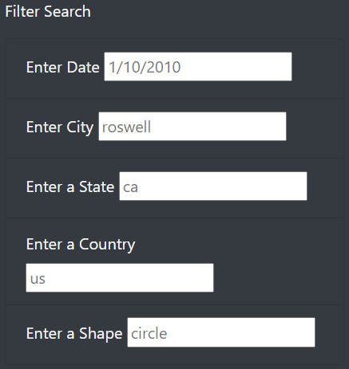

# UFO_Challenge

### Overview of the project
This project is intented to provide an analysis (with tables) of UFO sightings around multiple states in the US. 
The website created as a result of this project allows visitors and users of the website navigate among the data present on the website and filter for multiple criteria (such as city and state) at the same time.

The website helps users to visualize available data on UFO sightings, because without appropriate data and visualization, many things would become useless if it is not properly communicated.

### Results
The webpage created is relatviely simple and easy to follow. 
There is a filter search bar to the left of the page in order to enhance user experience and make it easier for users to specify their data criteria without the necessity of going through the whole table to count only a certain element (such as UFO sightings in a state).

The filter search updates the data set table to the right of the filter search bar to include the requested criteria only. 
There is no submit button or any type of button as the table would update and refresh itself after entering requested criteria.
For example, if I were to look for UFO sightings in New Jersey, I could type in nj in enter a state of the filter search, and the results would automatically appear. 
